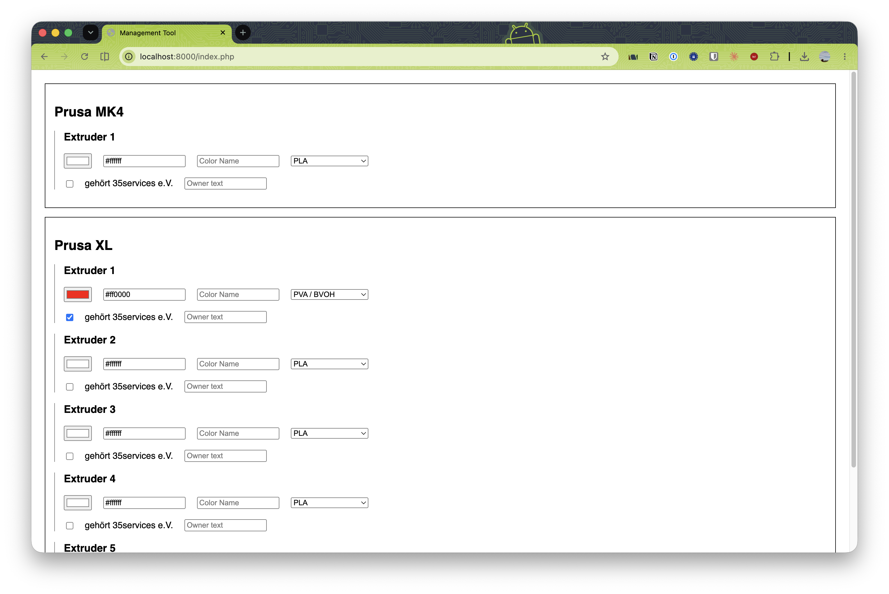

# Project Readme

## Summary
This is a management tool for a 3D printer. It requires PHP and a JSON configuration file. No database is necessary.



## Feature List
* Printer unit and extruder configuration via a JSON file
* State storage in a separate JSON file
* Modification without an authentication requirement
* Color selection via a picker or a hex input field
* Material dropdown using a predefined option
* Ownership assignment via a text input or a club checkbox with a customizable label (`club_label` in `config.json`)
* Input validation to prevent a security exploit
* Optional Slack notification when a filament's color changes
* Optional Signal notification when a filament's color changes, via a locally installed `signal-cli`

## Setup Instruction

### Docker (recommended)
1. Run `docker compose up`.
2. On first start, `config.json`, `state.json`, `slack.json` and `signal.json` are created automatically from their `.example.json` templates, and `config.json`/`state.json` are made writable.
3. Open a web browser and visit `http://localhost:81`.

`config.json`, `state.json`, `slack.json` and `signal.json` hold your actual printer setup, filament inventory, and notification credentials — they're gitignored, so edit them locally without worrying about committing personal data. To reset any of them, delete it and restart the container.

Note: the stock `docker-compose.yml` uses the plain `php:apache` image, which does **not** include `signal-cli`. Signal notifications only work if `signal-cli` is reachable from wherever `index.php` actually runs — either running the app directly on a host that already has `signal-cli` installed and linked (e.g. a Raspberry Pi), or building a custom image that adds it. Without that, the feature just silently does nothing, same as a missing `signal.json`.

### Manual (without Docker)
1. Open a terminal window.
2. Copy `config.example.json` to `config.json` and adjust it to your printers.
3. Copy `state.example.json` to `state.json`.
4. Grant write access to both files (`chmod 666 config.json state.json`).
5. Start a local PHP server (`php -S localhost:8000`).
6. Open a web browser and visit `http://localhost:8000`.

### Slack notifications (optional)
1. Create a Slack app at [api.slack.com/apps](https://api.slack.com/apps) → **From scratch**.
2. Under **OAuth & Permissions**, add the `chat:write` and `files:write` scopes, then **Install to Workspace** and copy the **Bot User OAuth Token** (`xoxb-...`).
3. Invite the bot to your target channel: `/invite @YourAppName` in that channel (or add the `chat:write.public` scope instead, to skip the invite).
4. Find the channel's ID — right-click the channel in Slack → **View channel details**, it's at the bottom of that panel (looks like `C0123456789`). Channel *names* like `#3d-druck` work for the text message but not for the image attachment, so use the ID.
5. Copy `slack.example.json` to `slack.json` and fill in `bot_token` and `channel` (the ID from step 4).
6. Save a filament color from the app — a message with a small color-swatch image is posted to that channel. `slack.json` is gitignored, and the feature is silently disabled if the file is missing or `bot_token`/`channel` are empty. If the image upload fails for any reason (e.g. `files:write` wasn't granted), it falls back to a plain text message so the notification is never lost.

### Signal notifications (optional, requires `signal-cli`)
1. Install and link [`signal-cli`](https://github.com/AsamK/signal-cli) on the machine `index.php` actually runs on, so it's linked to a Signal account (`signal-cli -a +<number> ...`). Only that host can send — see the Docker note above.
2. Find your target group's id with `signal-cli -a +<number> listGroups` — copy the `Id:` value (base64, e.g. `oT+8X2/...`).
3. Copy `signal.example.json` to `signal.json` and fill in `account` (the linked number, e.g. `+491701234567`) and `group_id`.
4. Save a filament color from the app — a message listing what changed is sent to that group via `signal-cli send`. `signal.json` is gitignored, and the feature is silently disabled if the file is missing, `account`/`group_id` are empty, or `cli_path` can't be found/run.

`cli_path` defaults to `signal-cli` (resolved via `PATH`), but it's used as a raw command prefix rather than a single binary path, so it can be a whole command line if `signal-cli` needs to run somewhere else — e.g. via Docker (see below). Since this only comes from your own local `signal.json`, not from the web UI, it's trusted the same way the rest of that file is.

#### Running `signal-cli` via Docker
`Dockerfile`/`signal-cli-docker.sh` build a `signal-image` image wrapping `signal-cli`. To set it up:
1. Build it: `./signal-cli-docker.sh` (or `docker build -t signal-image .`).
2. Link it to your Signal account, persisting the linked state to `./signal-state`:
   ```
   docker run -it --rm -v $(pwd)/signal-state:/root/.local/share/signal-cli signal-image link
   ```
   Scan the QR code it prints with the Signal app (**Linked devices → Link new device**).
3. Point `signal.json`'s `cli_path` at the same image and volume, so sends reuse the linked account:
   ```json
   "cli_path": "docker run --rm -v /full/path/to/signal-state:/root/.local/share/signal-cli signal-image"
   ```

Built and verified on both `amd64` and `arm64` (e.g. a 64-bit Raspberry Pi OS) — `signal-cli`'s official release only bundles the native `libsignal-client` library for `amd64` Linux, so the `Dockerfile` detects other architectures at build time and fetches a matching prebuilt native lib from [exquo/signal-libs-build](https://github.com/exquo/signal-libs-build) (`arm64`/`armhf` are handled; anything else fails the build with a clear error). If you bump `VERSION` to a newer `signal-cli` release, also update `LIBSIGNAL_VERSION` to match — check the `libsignal-client-<version>.jar` filename in that release's `lib/` directory.
   (use an absolute path here, not `$(pwd)` — that would expand to PHP's own working directory, not where `signal-state` actually lives.)

### Per-printer notification overrides
Each printer entry in `config.json` can add `slack`, `signal`, and/or `signal_channel` to override the defaults from `slack.json`/`signal.json` for just that printer:

```json
"printer_2": {
    "name": "Example Printer 2",
    "extruder_count": 5,
    "slack": false,
    "signal": false
},
"printer_3": {
    "name": "Example Printer 3",
    "extruder_count": 1,
    "signal_channel": "another-group-id-base64=="
}
```

* `slack`: set to `false` to skip Slack notifications for that printer's color changes. Omit (or `true`) to use the default (notify).
* `signal`: set to `false` to skip Signal notifications for that printer's color changes. Omit (or `true`) to use the default (notify).
* `signal_channel`: set to a different Signal group id to route that printer's notifications there instead of `signal.json`'s `group_id`. Omit to use the default group.

A save that changes colors on printers with different `signal_channel`s sends one batched Signal message per destination group.